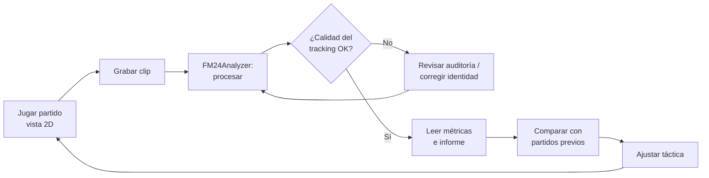
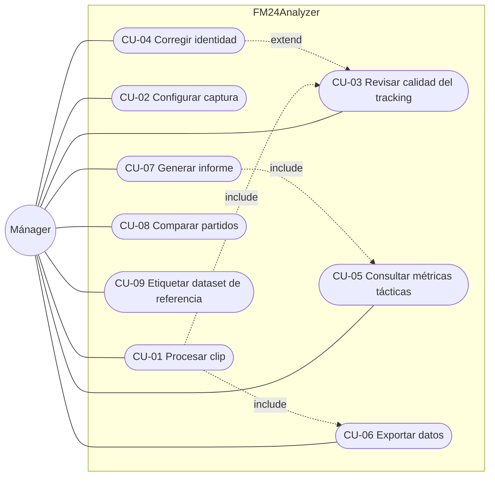

# FM24Analyzer
## Especificación de Requerimientos de Software (SRS)

**Versión:** 1.0 (aprobada por el cliente el 22/09/2026)
**Fecha:** 22/09/2026
**Cliente / usuario principal:** Tobias Locastro
**Analista / desarrollo:** Tobias Locastro + Claude
**Base normativa:** estructura inspirada en IEEE 830 / ISO/IEC/IEEE 29148
**Documentos relacionados:**
- `FM24Analyzer - Informe Maestro del Proyecto, Estado, Pendientes y Roadmap.md`
- `FM24Analyzer - Informe Técnico de Estado del Proyecto.md`
- `Auditoria 31 frames.md`
- `Backlog y Sprints.md`

---

## Control de versiones

| Versión | Fecha | Cambio | Autor |
|---|---|---|---|
| 0.1 | 22/09/2026 | Primer borrador a partir del informe maestro y la auditoría de 31 frames | Claude |
| 1.0 | 22/09/2026 | **Aprobada.** Resueltas D-01…D-09. La etiqueta de nombre no se puede desactivar ⇒ RF-32 (coast mode) pasa a M. Zoom 2D fijo con fichas grandes (RNF-10) | Toto / Claude |
| 0.2 | 22/09/2026 | Equipo propio = Racing. Nuevo módulo INT (lectura de la interfaz de FM24) tomado de la idea original del proyecto (`Analizar20de20Manager.md`). RF-15 (descartar frames sin partido) por evidencia del clip nuevo. D-08 resuelta: repo público | Claude |

## Cómo leer este documento

- Cada requerimiento tiene un **ID único** (`RF-xx`, `RNF-xx`, `CU-xx`, …) y se referencia siempre por ese ID.
- Cada requerimiento tiene un **criterio de verificación**. Si no se puede verificar, no es un requerimiento: es un deseo.
- La prioridad usa **MoSCoW**:
  - **M**ust: obligatorio para el MVP.
  - **S**hould: importante, pero no bloquea el MVP.
  - **C**ould: deseable.
  - **W**on't: fuera de alcance en esta versión.
- Los valores que en v0.x figuraban como **[A CONFIRMAR]** fueron aceptados por el cliente en la v1.0 (ver §12). Se conserva la marca para saber cuáles son propuestas del analista y no mediciones.
- "Debe" indica obligación. "Puede" indica opción. No se usan "debería", "idealmente" ni "aproximadamente" dentro de un requerimiento.

---

# 1. Introducción

## 1.1. Propósito

Este documento define **qué debe hacer FM24Analyzer y cómo debe comportarse**. Es el plano del producto: todo desarrollo, prueba y entrega se valida contra este documento.

Se escribe **antes** de seguir construyendo capas nuevas (espacio, eventos, táctica), para que cada sprint tenga un objetivo verificable y no se agreguen funcionalidades porque "se puede".

## 1.2. Alcance del producto

FM24Analyzer es una aplicación **local** para Windows. Recibe una grabación de video de un partido de Football Manager 24 en **vista 2D** y produce:

1. la posición de cada jugador en cada frame;
2. la identidad persistente de cada jugador (equipo, rol, dorsal);
3. trayectorias en coordenadas normalizadas de la cancha;
4. métricas colectivas de estructura (altura, amplitud, profundidad y compactación del equipo);
5. exportaciones de datos (JSON/CSV) y un informe visual del partido o del segmento analizado.

### Dentro del alcance (versión 1.0 / MVP)

- Video grabado de FM24, vista 2D clásica, cámara de cancha completa.
- Un clip por ejecución.
- Procesamiento por lotes (offline), sin tiempo real.
- Interfaz por línea de comandos (CLI).

### Fuera del alcance (versión 1.0)

| Excluido | Motivo |
|---|---|
| Vista 3D del motor de partido | Otra geometría y otra apariencia; exigiría otro detector |
| Análisis en tiempo real mientras se juega | No es necesario para el objetivo de negocio; complica todo |
| Lectura de la memoria del juego / modding | Riesgo, fragilidad ante parches; el proyecto es por visión |
| Detección de eventos (pases, tiros, recuperaciones) | Post-MVP (ver §7, módulo EVT) |
| Inferencia automática de formación "por nombre" (4-2-3-1, etc.) | Post-MVP |
| Interfaz gráfica | Post-MVP |
| Otros juegos u otras versiones de FM | No validado |

## 1.3. Definiciones, acrónimos y abreviaturas

| Término | Definición |
|---|---|
| **Ficha / token** | Círculo que representa a un jugador en la vista 2D de FM24. Radio observado: 7–8 px a 1280×720 |
| **Dorsal** | Número dibujado dentro de la ficha |
| **Etiqueta de nombre** | Rótulo con el apellido que FM24 dibuja sobre la ficha del jugador que tiene la pelota (ej. "Miranda"). **No se puede desactivar**: siempre hay 1 o 2 fichas con etiqueta, y en el saque inicial todas la tienen. Al usuario le sirve para saber quién es quién mientras mira el partido |
| **ROI** | *Region of Interest*: rectángulo de la imagen que corresponde a la cancha |
| **Frame** | Imagen individual del video. A 30 FPS dura 33,3 ms |
| **Transición** | Par de frames consecutivos (n-1 → n). N frames generan N-1 transiciones |
| **Detección** | Candidato a ficha encontrado en un frame. Se identifica con `token_id`, que solo vale dentro de ese frame |
| **Track** | Identidad persistente de un jugador a lo largo del tiempo. Se identifica con `track_id` |
| **Match (asociación)** | Asignación de una detección a un track en una transición |
| **Cobertura de asociación** | matches / tracks activos en una transición |
| **Grupo de asociación** | Conjunto dentro del que se permite asociar: EQUIPO_PROPIO, RIVAL, GK. *Antes se lo llamaba "bloque"; se renombra para no confundirlo con el bloque táctico* |
| **Bloque (táctico)** | Estructura colectiva de un equipo sin pelota, caracterizada por altura, amplitud, profundidad y compactación |
| **Gating** | Descarte de asociaciones que superan una distancia máxima (`MAX_DISTANCE`) |
| **Coast mode** | Mantener vivo un track durante N frames sin detección, estimando su posición |
| **ID switch** | Error en el que dos tracks intercambian sus identidades |
| **Equipo propio** | El equipo del usuario en el video: **Racing**. En el clip de prueba (20/09) Racing juega de azul oscuro; en el clip del 22/09, de blanco. El color **no** identifica al equipo: se configura por video |
| **Coordenadas normalizadas** | Posición en la cancha expresada en [0,1] × [0,1], independiente de la resolución del video |
| **Dataset de referencia** | Conjunto de frames con posiciones e identidades etiquetadas a mano, usado para medir la exactitud |
| **MVP** | Mínimo producto viable: la versión más chica que ya resuelve la necesidad principal del usuario (§10) |
| **TBD / [A CONFIRMAR]** | Valor pendiente de decisión del cliente |

## 1.4. Visión general

- §2 describe el dominio.
- §3 y §4 describen el negocio y sus procesos.
- §5 y §6 bajan eso a casos de uso.
- §7 y §8 son los requerimientos propiamente dichos.
- §9 a §13 cubren restricciones, MVP, aceptación, decisiones pendientes y trazabilidad.

---

# 2. Introducción al dominio del problema

## 2.1. Football Manager 24 y el motor de partido

Football Manager 24 (FM24) es un simulador de gestión de fútbol. El usuario no controla a los jugadores: define una **táctica** (formación, roles, instrucciones) y el motor de partido simula el juego.

Por eso, la única forma de saber si una táctica funciona es **observar el comportamiento que produce**:
- dónde se ubican los jugadores;
- cómo se mueve el bloque;
- quién abandona su zona;
- cómo reacciona el equipo al perder la pelota.

## 2.2. La vista 2D

En la vista 2D, cada jugador es una ficha circular del color de su equipo, con el dorsal adentro. La cámara muestra la cancha completa desde arriba. Esto hace el problema de visión muy controlado:

- tamaño de ficha casi constante (radio 7–8 px en 1280×720);
- colores de equipo diferenciables (en el clip de prueba, Racing azul oscuro y Rival celeste);
- arqueros con un color distinto y desaturado;
- geometría de la cancha fija dentro del ROI.

Hay complicaciones reales, ya observadas:

| Complicación | Evidencia |
|---|---|
| El dorsal ocupa el centro de la ficha y altera su color medio | Auditoría 31 frames, §3: el Rival #10 se clasificó como Racing en 16 frames |
| La etiqueta de nombre tapa la ficha del portador de la pelota | Auditoría 31 frames, §4: el Racing #10 no se detectó en 7 frames |
| Las líneas y arcos de la cancha generan círculos falsos | Auditoría 31 frames, §5: falso arquero sobre el arco del área |
| Las fichas pegadas se tapan entre sí | Riesgo conocido, todavía no medido |
| Los equipos cambian de lado en el entretiempo | El lado de la cancha no identifica al equipo |

## 2.3. Qué ofrece FM24 hoy y qué falta

FM24 ofrece estadísticas del partido y algunas vistas de análisis dentro del juego, pero **no exporta la posición de los jugadores frame a frame**. Tampoco permite:

- calcular métricas de estructura propias (altura del bloque, compactación, amplitud) por segmento del partido;
- comparar de forma reproducible distintos partidos o distintas versiones de una táctica;
- guardar los datos para analizarlos con herramientas externas (Python, Excel).

FM24Analyzer llena ese hueco reconstruyendo los datos posicionales a partir del video.

---

# 3. Necesidades, objetivos del negocio y del proyecto

> En este proyecto "el negocio" es la actividad del usuario como mánager de FM24: diseñar tácticas, probarlas y ajustarlas.

## 3.1. Necesidades del negocio

| ID | Necesidad |
|---|---|
| N-01 | Saber si el equipo se comporta en la cancha como la táctica pretende (ej. si el 4-2-3-1 realmente se ve como 4-2-3-1 sin pelota) |
| N-02 | Detectar qué jugadores abandonan su zona o rompen la estructura |
| N-03 | Medir la estructura del equipo (altura, amplitud, profundidad, compactación) en vez de estimarla a ojo |
| N-04 | Comparar el comportamiento entre segmentos, partidos o versiones de la táctica |
| N-05 | Tener los datos crudos para análisis propios fuera del juego |
| N-06 | Que el análisis no dependa de pausar el partido y anotar a mano |

## 3.2. Objetivos del negocio

| ID | Objetivo | Indicador |
|---|---|---|
| OB-01 | Reducir el tiempo de análisis táctico de un clip | Tiempo de análisis manual vs. tiempo de FM24Analyzer para el mismo clip |
| OB-02 | Tomar decisiones tácticas basadas en datos medidos | Cada cambio de táctica queda asociado a un informe comparativo |
| OB-03 | Construir un historial comparable de partidos | Cantidad de partidos procesados con formato de salida estable |

## 3.3. Objetivos del proyecto

| ID | Objetivo | Criterio |
|---|---|---|
| OP-01 | Pipeline reproducible video → datos posicionales con identidad | Dos ejecuciones sobre el mismo video producen salidas idénticas byte a byte |
| OP-02 | Error conocido y medido en cada capa | Cada capa tiene una métrica y un benchmark sobre el dataset de referencia |
| OP-03 | Entregar un MVP usable por CLI con un comando | §10 |
| OP-04 | Código fuente mantenible y documentado, entregado completo | Repositorio con README, tests de regresión y configuración centralizada |
| OP-05 | Proyecto de portfolio que demuestre el proceso completo (SRS → sprints → MVP) | Documentación de este proceso incluida en el repositorio |

---

# 4. Descripción de los procesos del negocio

## 4.1. Proceso actual (AS-IS): análisis manual

```text
1. El usuario juega el partido en FM24.
2. Mira momentos del partido (en vivo o en la repetición).
3. Pausa en situaciones que le interesan.
4. Observa a ojo la ubicación de los jugadores.
5. Saca conclusiones subjetivas ("el lateral sube demasiado").
6. Cambia la táctica.
7. Juega otro partido y vuelve al paso 2.
```

**Problemas del AS-IS:**
- es subjetivo y no se puede medir;
- no queda registro comparable;
- consume tiempo;
- depende de la memoria del usuario;
- no detecta patrones que aparecen de a poco o fuera de las pausas.

## 4.2. Proceso propuesto (TO-BE): análisis asistido

```text
1. El usuario juega el partido en FM24 con vista 2D.
2. Graba el segmento de interés con un grabador de pantalla.
3. Ejecuta FM24Analyzer sobre el video.
4. El sistema procesa y genera datos + informe.
5. El usuario revisa el informe de calidad (¿el tracking fue confiable?).
6. El usuario lee las métricas tácticas y visualizaciones.
7. Compara contra partidos o versiones anteriores de la táctica.
8. Cambia la táctica con evidencia medida.
```

## 4.3. Diagrama del proceso TO-BE



---

# 5. Casos de uso del negocio

| ID | Caso de uso de negocio | Actor | Resultado de valor |
|---|---|---|---|
| CUN-01 | Evaluar una táctica en un partido | Mánager | Saber si la estructura real coincide con la esperada |
| CUN-02 | Diagnosticar un problema táctico concreto | Mánager | Identificar jugador/zona/momento responsable |
| CUN-03 | Comparar dos versiones de una táctica | Mánager | Decidir cuál conservar con base en datos |
| CUN-04 | Construir un historial de partidos | Mánager | Ver la evolución del equipo en la temporada |
| CUN-05 | Explotar datos en herramientas externas | Mánager / analista | Análisis propio en Python/Excel |

---

# 6. Casos de uso del sistema

## 6.1. Actores

| Actor | Descripción |
|---|---|
| **Mánager (usuario)** | Juega FM24, graba clips, ejecuta el sistema y lee los resultados. Único actor humano en la v1.0 |
| **Sistema de archivos** | Actor secundario: fuente de videos y destino de las salidas |

## 6.2. Diagrama de casos de uso del sistema



## 6.3. Resumen de casos de uso

| ID | Nombre | Prioridad | Sprint objetivo |
|---|---|---|---|
| CU-01 | Procesar clip | M | S1–S4 |
| CU-02 | Configurar captura | M | S3 |
| CU-03 | Revisar calidad del tracking | M | S1 |
| CU-04 | Corregir identidad | S | Post-MVP |
| CU-05 | Consultar métricas tácticas | M | S4 |
| CU-06 | Exportar datos | M | S3 |
| CU-07 | Generar informe | M | S4 |
| CU-08 | Comparar partidos | C | Post-MVP |
| CU-09 | Etiquetar dataset de referencia | M | S1 |

## 6.4. Especificación de casos de uso

### CU-01 — Procesar clip

| Campo | Contenido |
|---|---|
| Actor | Mánager |
| Precondiciones | Existe un video que cumple RNF-10 (formato de entrada). Existe una configuración de captura válida (CU-02) o se usa la configuración por defecto |
| Disparador | El usuario ejecuta `fm24analyzer analyze <video>` |
| Flujo principal | 1. El sistema valida el video (RF-01). 2. Carga la configuración (RF-02). 3. Detecta fichas en cada frame (RF-10). 4. Clasifica el grupo (RF-12). 5. Inicializa tracks e identidades (RF-20, RF-21). 6. Asocia detecciones a tracks en cada transición (RF-30). 7. Convierte posiciones a coordenadas normalizadas (RF-40). 8. Escribe las salidas (RF-60) y el informe de calidad (RF-70). 9. Muestra un resumen en consola |
| Flujo alternativo A1 | Video inválido en el paso 1: el sistema termina con un mensaje que indica qué condición falla y no genera salidas parciales |
| Flujo alternativo A2 | En el paso 5 no se inicializan 22 tracks: el sistema continúa, registra el faltante en el informe de calidad y marca la ejecución como `DEGRADED` |
| Flujo alternativo A3 | El usuario interrumpe (Ctrl+C): se guardan las salidas hasta el último frame completo y se marca la ejecución como `PARTIAL` |
| Postcondiciones | Existe una carpeta de salida por ejecución (RF-60) con datos, informe de calidad y metadatos de ejecución |

### CU-02 — Configurar captura

| Campo | Contenido |
|---|---|
| Actor | Mánager |
| Propósito | Adaptar el sistema a un video con otra resolución, ROI o colores de equipo |
| Flujo principal | 1. El usuario ejecuta `fm24analyzer calibrate <video>`. 2. El sistema muestra el primer frame. 3. El usuario marca el ROI de la cancha. 4. El sistema propone los colores de los dos equipos y de los arqueros. 5. El usuario confirma cuál es el equipo propio. 6. El sistema guarda un archivo de configuración |
| Postcondiciones | Existe un archivo de configuración reutilizable para videos con la misma captura |

### CU-03 — Revisar calidad del tracking

| Campo | Contenido |
|---|---|
| Actor | Mánager |
| Propósito | Saber cuánto confiar en los datos antes de sacar conclusiones tácticas |
| Flujo principal | 1. El usuario abre el informe de calidad de la ejecución. 2. Ve la cobertura de asociación por transición, las pérdidas por track y su causa diagnosticada (RF-70, RF-71). 3. Abre las imágenes de auditoría de las transiciones con pérdidas |
| Postcondiciones | El usuario sabe qué segmentos y qué jugadores tienen datos confiables |

### CU-04 — Corregir identidad (Post-MVP)

| Campo | Contenido |
|---|---|
| Actor | Mánager |
| Propósito | Corregir a mano un dorsal mal leído o un ID switch |
| Flujo principal | 1. El usuario indica `track_id` y el dorsal o equipo correcto, a partir de un frame. 2. El sistema recalcula las salidas dependientes |

### CU-05 — Consultar métricas tácticas

| Campo | Contenido |
|---|---|
| Actor | Mánager |
| Flujo principal | 1. El usuario ejecuta `fm24analyzer metrics <ejecución> [--desde t1 --hasta t2]`. 2. El sistema calcula las métricas RF-50 a RF-54 para el segmento y el equipo. 3. Las muestra en consola y las guarda en CSV |

### CU-06 — Exportar datos

| Campo | Contenido |
|---|---|
| Actor | Mánager |
| Flujo principal | El sistema genera, en cada ejecución, las exportaciones definidas en RF-60 a RF-62 |

### CU-07 — Generar informe

| Campo | Contenido |
|---|---|
| Actor | Mánager |
| Flujo principal | 1. El usuario ejecuta `fm24analyzer report <ejecución>`. 2. El sistema genera un informe HTML local con posiciones medias, mapas de calor, métricas de estructura y el resumen de calidad (RF-80) |

### CU-08 — Comparar partidos (Could)

| Campo | Contenido |
|---|---|
| Actor | Mánager |
| Flujo principal | El usuario selecciona dos o más ejecuciones y el sistema muestra las métricas RF-50 a RF-54 lado a lado |

### CU-09 — Etiquetar dataset de referencia

| Campo | Contenido |
|---|---|
| Actor | Mánager |
| Propósito | Construir la verdad de referencia contra la que se mide la exactitud (RNF-01 a RNF-05) |
| Flujo principal | 1. El sistema propone detecciones e identidades para un conjunto de frames. 2. El usuario las confirma o corrige. 3. El sistema guarda el dataset en un formato versionado |
| Postcondiciones | Existe un dataset de referencia versionado, usado por los benchmarks |

---

# 7. Requisitos funcionales

Formato: **ID · Prioridad · Requisito · Criterio de verificación**.

## 7.1. Módulo ENT — Entrada y configuración

| ID | P | Requisito | Verificación |
|---|---|---|---|
| RF-01 | M | El sistema debe validar que el video existe, se puede abrir y cumple RNF-10. Si no cumple, debe informar cuál es la condición que falla | Test con video inexistente, con una resolución no soportada y con uno válido |
| RF-02 | M | Todos los parámetros (ROI, Hough, umbrales de color, gating, nombres de equipo) deben leerse de **un único archivo de configuración**. El código no debe tener valores numéricos de configuración | Búsqueda en el código: ninguna constante de configuración fuera del módulo de configuración |
| RF-03 | M | El sistema debe permitir indicar qué equipo es el **equipo propio** y el nombre de cada equipo. No debe asumir "RACING" | Ejecución con otro nombre de equipo |
| RF-04 | S | El sistema debe permitir procesar un rango del video (`--desde`, `--hasta`, en segundos o en frames) | Ejecución con un rango: la salida contiene solo esos frames |
| RF-05 | S | Configuración asistida del ROI y los colores (CU-02) | Configuración generada para un video nuevo y ejecución exitosa con ella |

## 7.2. Módulo PER — Percepción

| ID | P | Requisito | Verificación |
|---|---|---|---|
| RF-10 | M | El sistema debe detectar las fichas de jugadores de campo dentro del ROI en cada frame procesado | RNF-01 |
| RF-11 | M | El sistema debe detectar a los dos arqueros con un detector específico. Debe descartar candidatos generados por líneas y arcos de la cancha | RNF-01. El falso arquero sobre el arco del área (auditoría §5) ya no aparece |
| RF-12 | M | El sistema debe clasificar cada detección en EQUIPO_PROPIO, RIVAL o GK a partir del color de la **zona de camiseta de la ficha, excluyendo el dorsal** | RNF-02. Caso de regresión: Rival #10 en los frames 10–28 del clip de prueba |
| RF-13 | M | El sistema debe detectar fichas parcialmente tapadas por la etiqueta de nombre, o marcar explícitamente que el track está ocluido (ver RF-32) | Caso de regresión: Racing #10 en los frames 24–30 del clip de prueba |
| RF-14 | S | Cada detección debe registrar su fuente (normal / sensitive / goalkeeper) y una medida de confianza | Campo presente en la salida |
| RF-15 | M | El sistema debe detectar los tramos del video en los que **no se ve la cancha** (menús, preferencias, pantallas de configuración) y excluirlos del análisis, registrándolos en el informe de calidad | Clip 22/09: los tramos 1:14–2:05 (menú de Preferencias) y 0:31–0:40 (panel de cámara) salen marcados como excluidos |

## 7.3. Módulo IDN — Identificación

| ID | P | Requisito | Verificación |
|---|---|---|---|
| RF-20 | M | El sistema debe leer el dorsal de cada ficha mediante templates y registrar `score`, `second-best` y `gap` | Benchmark de dorsales |
| RF-21 | M | El dorsal de un **track** debe decidirse por votación sobre múltiples frames, no por un único frame | RNF-03 sobre el dataset de referencia |
| RF-22 | M | La combinación (grupo, dorsal) debe ser única entre los tracks activos. Un conflicto debe registrarse como alerta | Test con un conflicto provocado |
| RF-23 | S | Si el dorsal no alcanza el umbral de confianza, el track debe quedar como `UNKNOWN`, sin inventar un número | Test con una ficha degradada |

## 7.4. Módulo TRK — Tracking

| ID | P | Requisito | Verificación |
|---|---|---|---|
| RF-30 | M | El sistema debe asociar detecciones a tracks en cada transición con el algoritmo húngaro, restringido por grupo de asociación y por gating | Test unitario de `assign_tracks` |
| RF-31 | M | Un track sin match debe conservar su identidad y registrar cuántos frames seguidos lleva sin match | Campo `missed_streak` en la salida |
| RF-32 | M | Un track sin match debe poder mantenerse con posición estimada (**coast mode**) durante un máximo de `MAX_COAST_FRAMES` frames. Las posiciones estimadas deben marcarse como `estimated` | Test sobre una oclusión conocida (Racing #10, frames 24–30) |
| RF-33 | S | Un track perdido más de `MAX_COAST_FRAMES` frames debe poder **reidentificarse** por grupo + dorsal cuando reaparece | Test con una reaparición provocada |
| RF-34 | M | El sistema debe ser determinista: mismo video + misma configuración ⇒ salida idéntica | RNF-07 |

## 7.5. Módulo ESP — Reconstrucción espacial

| ID | P | Requisito | Verificación |
|---|---|---|---|
| RF-40 | M | El sistema debe convertir cada posición a coordenadas normalizadas de la cancha: x ∈ [0,1] de arco a arco, y ∈ [0,1] de lateral a lateral | Las esquinas del ROI mapean a (0,0), (1,0), (0,1), (1,1) ±0,01 |
| RF-41 | M | El sistema debe expresar las posiciones también en **metros**, con dimensiones de cancha configurables (por defecto 105 × 68 [A CONFIRMAR]) | Medición de la distancia entre las áreas contra su valor reglamentario |
| RF-42 | M | El sistema debe normalizar la dirección de ataque: el equipo propio ataca siempre hacia x = 1, aunque cambie de lado | Test con un clip de cada tiempo |

## 7.6. Módulo MET — Métricas tácticas

Todas las métricas se calculan por equipo, por segmento de tiempo y **solo con jugadores de campo** (sin el arquero), salvo que se indique otra cosa.

| ID | P | Requisito (definición exacta) | Verificación |
|---|---|---|---|
| RF-50 | M | **Posición media**: promedio de x e y de cada jugador en el segmento, en metros | Caso sintético con resultado conocido |
| RF-51 | M | **Altura del bloque**: promedio de x de los 4 jugadores de campo más retrasados del equipo, en metros desde el arco propio [A CONFIRMAR: definición de "línea defensiva"] | Caso sintético |
| RF-52 | M | **Profundidad**: diferencia en x entre el jugador de campo más adelantado y el más retrasado, en metros | Caso sintético |
| RF-53 | M | **Amplitud**: diferencia en y entre el jugador de campo más abierto de cada banda, en metros | Caso sintético |
| RF-54 | M | **Compactación**: área del polígono convexo que forman los jugadores de campo, en m² | Caso sintético (cuadrado de 10 m ⇒ 100 m²) |
| RF-55 | S | **Mapa de calor** por jugador y por equipo sobre la grilla de la cancha | Imagen generada con la suma de ocupación = frames procesados |
| RF-56 | S | Todas las métricas deben poder calcularse como **serie temporal** (valor por segundo), además del promedio | Salida CSV con una fila por segundo |
| RF-57 | W (v1.0) | Separar métricas **con pelota / sin pelota** | Requiere detectar la posesión (post-MVP) |

## 7.7. Módulo SAL — Salidas y exportación

| ID | P | Requisito | Verificación |
|---|---|---|---|
| RF-60 | M | Cada ejecución debe crear una carpeta propia `runs/<fecha>_<nombre-video>/` y no debe sobrescribir ejecuciones anteriores | Dos ejecuciones generan dos carpetas |
| RF-61 | M | El sistema debe exportar `tracks.csv` con una fila por (frame, track_id): frame, timestamp_ms, track_id, grupo, dorsal, x_px, y_px, x_norm, y_norm, x_m, y_m, estado (`detected`/`estimated`/`lost`) | Esquema validado por test |
| RF-62 | M | El sistema debe exportar `run.json` con los metadatos: versión del software, hash del video, configuración usada, fecha, duración y resultado (`OK` / `DEGRADED` / `PARTIAL`) | Archivo presente y válido |
| RF-63 | S | El formato de salida debe estar **versionado** (`schema_version`). Un cambio incompatible debe incrementar la versión | Campo presente |

## 7.8. Módulo CAL — Calidad y auditoría

| ID | P | Requisito | Verificación |
|---|---|---|---|
| RF-70 | M | Cada ejecución debe generar un informe de calidad con: distribución de matches por transición, pérdidas por track y por grupo, y diagnóstico por pérdida (`NO_DETECTION`, `WRONG_BLOCK`, `GATING`, `CONTESTED`) | Equivalente a `audit_transitions.py`, integrado al pipeline |
| RF-71 | S | Para las transiciones con pérdidas, el sistema debe generar imágenes de auditoría (opción `--audit-images`) | Imágenes generadas |
| RF-72 | M | Debe existir un **benchmark repetible** que compare la salida con el dataset de referencia y reporte las métricas RNF-01 a RNF-05 | `fm24analyzer benchmark` produce un reporte |
| RF-73 | M | Debe existir una **prueba de regresión**: los casos conocidos (clip de prueba, frames 0–30) no pueden empeorar entre versiones | Test automático |

## 7.9. Módulo INF — Informe

| ID | P | Requisito | Verificación |
|---|---|---|---|
| RF-80 | M | El sistema debe generar un informe HTML local, autocontenido (abre sin internet), con: resumen de calidad, posiciones medias de ambos equipos sobre la cancha, métricas RF-50 a RF-54, series temporales de RF-56 y mapas de calor de RF-55 | El informe abre con doble clic |
| RF-81 | S | El informe debe indicar de forma visible los segmentos con calidad insuficiente (cobertura < umbral de RNF-04) | Segmento degradado marcado en el informe |

## 7.10. Módulo INT — Lectura de la interfaz de FM24

Viene de la idea original del proyecto: además de la cancha, la pantalla de FM24 muestra datos que dan **identidad y contexto** sin tener que inferirlos. El panel inferior de la vista de partido lista cada posición con el nombre y el dorsal del jugador, y la táctica configurada (ej. "4-3-3 MC ABIERTO POSITIVA").

| ID | P | Requisito | Verificación |
|---|---|---|---|
| RF-100 | S | El sistema debe leer del panel inferior la alineación del equipo propio: posición nominal (POR, DFD, DFCD, …), nombre y dorsal | Clip 22/09: las 11 posiciones de Racing leídas correctamente |
| RF-101 | S | El sistema debe usar la alineación de RF-100 para asignar a cada track del equipo propio su **nombre y posición nominal**, a partir del dorsal | Cada track de Racing tiene nombre y posición nominal |
| RF-102 | S | El sistema debe leer la formación y la mentalidad configuradas (ej. "4-3-3", "Positiva") | Texto leído igual al de la pantalla |
| RF-103 | C | El sistema debe comparar la **estructura configurada** con la **estructura observada** (posiciones medias) e informar la diferencia (ej. "4-3-3 configurado, 3-2-5 observado con pelota") | Depende de RF-57 y RF-93 |
| RF-104 | C | El sistema debe detectar sustituciones (cambio en el panel o aparición de un dorsal nuevo) | Caso con una sustitución grabada |
| RF-105 | W (v1.0) | Leer las estadísticas finales del partido (posesión, tiros, xG) de la pantalla de resultados | — |

> **Regla de inferencia:** lo que se lee de la pantalla (formación configurada, alineación) se presenta como **dato**. Lo que se deduce (motivo de una suplencia, intención táctica) se presenta como **inferencia**, con esa etiqueta, nunca como hecho.

## 7.11. Módulo EVT — Eventos (Post-MVP, referencia)

| ID | P | Requisito |
|---|---|---|
| RF-90 | W (v1.0) | Detectar la pelota y la posesión |
| RF-91 | W (v1.0) | Detectar recuperaciones y pérdidas |
| RF-92 | W (v1.0) | Segmentar el partido en fases (ataque organizado, defensa organizada, transiciones) |
| RF-93 | W (v1.0) | Inferir la formación nominal (4-2-3-1, 4-4-2, …) a partir de las posiciones medias |

---

# 8. Requisitos no funcionales

## 8.1. Exactitud (medida sobre el dataset de referencia, RF-72)

| ID | Requisito | Valor objetivo |
|---|---|---|
| RNF-01 | **Recall de detección**: fichas detectadas / fichas reales | ≥ 99 % [A CONFIRMAR] |
| RNF-02 | **Exactitud de clasificación de grupo**: detecciones con grupo correcto / detecciones correctas | ≥ 99,5 % [A CONFIRMAR] |
| RNF-03 | **Exactitud del dorsal por track** (tras votación RF-21) | ≥ 95 % de los tracks [A CONFIRMAR] |
| RNF-04 | **Cobertura de asociación** media por transición | ≥ 99 % [A CONFIRMAR]. Hoy es ≈ 96,5 % en el clip de prueba |
| RNF-05 | **ID switches** en el clip de referencia | 0 [A CONFIRMAR] |
| RNF-06 | **Error de posición** de una detección contra la referencia | ≤ 2 px de mediana |

## 8.2. Reproducibilidad

| ID | Requisito |
|---|---|
| RNF-07 | Dos ejecuciones con el mismo video y la misma configuración deben producir archivos de datos idénticos byte a byte. *Estado: verificado para `batch_tracker.py`* |
| RNF-08 | Las dependencias deben tener versiones fijas en `requirements.txt` |

## 8.3. Rendimiento

| ID | Requisito |
|---|---|
| RNF-09 | En la notebook del usuario, el sistema debe procesar 1 minuto de video (1800 frames) en ≤ 5 minutos [A CONFIRMAR] |

| RNF-20 | **Videos largos (30+ min).** El sistema debe procesar el video en streaming, con memoria constante: no se carga el video entero ni se guarda un JSON por frame. Debe poder analizar a una frecuencia configurable (`analysis_fps`, por defecto 10) y reanudar un análisis cortado desde el último punto guardado. Medición del 22/09: detección 51 ms/frame y lectura 5 ms/frame ⇒ 30 min a 30 fps ≈ 50 min; a 10 fps ≈ 20 min; en paralelo por tramos (12 núcleos) se estima ≈ 5 min [A MEDIR] |

## 8.4. Entrada soportada

| ID | Requisito |
|---|---|
| RNF-10 | Video MP4 (H.264), **1920×1080** (sin reescalar desde el monitor), 30 FPS, bitrate ≥ 12 Mbps, vista "2D Clásico" de FM24 con la cancha completa visible, el panel inferior visible y **siempre el mismo zoom** (D-09): el del clip `2026-09-22 18-30-38`, con las líneas de la cancha de x≈273 a x≈1006 a 1280 px de ancho. Objetivo: fichas de radio ≥ 8 px. Los clips a 1280×720 se aceptan solo para desarrollo. Otros formatos deben rechazarse con un mensaje claro (RF-01). Se podrán agregar formatos cuando se validen |

## 8.5. Portabilidad y entorno

| ID | Requisito |
|---|---|
| RNF-11 | Debe funcionar en Windows 11 con Python 3.13 y OpenCV 5.0 |
| RNF-12 | Debe funcionar **offline** y no puede enviar datos a servicios externos |

## 8.6. Mantenibilidad

| ID | Requisito |
|---|---|
| RNF-13 | Código organizado en módulos por capa: config, detector, classifier, digit_reader, tracker, spatial, metrics, report, pipeline, cli |
| RNF-14 | Cada módulo M debe tener tests unitarios. Los tests deben correr con un solo comando (`pytest`) |
| RNF-15 | El código fuente debe estar versionado con git y cada entrega de sprint debe tener un tag (`v0.1.0`, `v0.2.0`, …) |
| RNF-16 | Debe haber logging estructurado con niveles (INFO/DEBUG) en lugar de `print` sueltos |

## 8.7. Usabilidad

| ID | Requisito |
|---|---|
| RNF-17 | El análisis completo de un clip debe poder ejecutarse con **un único comando** |
| RNF-18 | Los mensajes de error deben decir qué pasó y qué puede hacer el usuario |
| RNF-19 | Debe existir un README con instalación, uso y ejemplo completo, reproducible por otra persona en ≤ 15 minutos |

---

# 9. Restricciones y supuestos

## 9.1. Restricciones

| ID | Restricción |
|---|---|
| R-01 | Presupuesto cero: solo herramientas y bibliotecas gratuitas |
| R-02 | Procesamiento local en la PC del usuario |
| R-03 | Visión clásica (OpenCV) como enfoque base. Deep learning solo si una limitación medida lo justifica (Informe Maestro §23) |
| R-04 | Tiempo de desarrollo limitado por la cursada: horario protegido de estudio de lunes a viernes de 9 a 16. Se trabaja fuera de esa franja |

## 9.2. Supuestos

| ID | Supuesto | Qué pasa si es falso |
|---|---|---|
| S-01 | Los dos equipos usan colores distinguibles entre sí y del arquero | Hace falta calibración por partido (CU-02) o una regla adicional |
| S-02 | El usuario graba en vista 2D con la cancha completa | El sistema rechaza el video |
| S-03 | La interfaz de FM24 no cambia entre partidos de forma relevante | Se recalibra el ROI (CU-02) |
| S-04 | ~~La etiqueta de nombre se puede desactivar~~ **Falso (22/09):** no se puede desactivar | RF-13 y RF-32 son críticos (M) |

---

# 10. Definición del MVP

## 10.1. Qué resuelve

El MVP responde **CUN-01 (evaluar una táctica en un partido)** con datos medidos:

> "Dado un clip de mi partido, mostrame dónde estuvo cada jugador, cómo fue la estructura de mi equipo y cuánto puedo confiar en esos datos."

## 10.2. Qué incluye

Todos los requerimientos con prioridad **M** de los módulos ENT, PER, IDN, TRK, ESP, MET, SAL, CAL e INF.

## 10.3. Qué no incluye

- Detección de eventos y posesión (EVT).
- Separación con / sin pelota (RF-57).
- Comparación de partidos (CU-08).
- Interfaz gráfica.

## 10.4. Entregable del MVP

```text
fm24analyzer analyze partido.mp4
        ↓
runs/2026-xx-xx_partido/
    run.json
    tracks.csv
    metrics.csv
    quality.json
    report.html
```

---

# 11. Criterios de aceptación del MVP

El MVP se considera **aceptado** cuando se cumplen todos estos puntos:

1. `fm24analyzer analyze` procesa sin errores un clip de al menos **60 segundos con juego en movimiento** que no se haya usado para desarrollar.
2. Sobre el dataset de referencia se cumplen RNF-01 a RNF-05.
3. `report.html` muestra las métricas RF-50 a RF-54 del equipo propio y del rival.
4. RNF-07 (determinismo) verificado en ese clip.
5. `pytest` pasa completo, incluyendo la regresión RF-73.
6. README permite a otra persona reproducir el análisis (RNF-19).
7. El código fuente completo está entregado en el repositorio con el tag `v1.0.0`.

---

# 12. Decisiones del cliente

Todas resueltas el 22/09/2026. La SRS queda aprobada como v1.0.

| # | Pregunta | Propuesta del analista |
|---|---|---|
| D-01 | ¿Los umbrales de exactitud RNF-01 a RNF-05 son razonables para vos? | **Aceptado:** los valores de §8.1 |
| D-02 | ¿Qué tiempo de procesamiento es aceptable (RNF-09)? | **Aceptado:** ≤ 5 min por minuto de video |
| D-03 | ¿Se puede desactivar la etiqueta de nombre en la vista 2D de FM24? | **No se puede.** Siempre hay 1–2 jugadores con etiqueta y al usuario le sirve verla. Se resuelve por software (RF-13, RF-32) |
| D-04 | ¿Cómo definís "línea defensiva" para la altura del bloque (RF-51)? | **Aceptado:** los 4 jugadores de campo más retrasados |
| D-05 | ¿Qué dimensiones de cancha usamos (RF-41)? | **Aceptado:** 105 × 68 m |
| D-06 | ¿Qué largo tienen los clips que vas a analizar habitualmente: fragmentos o partido completo? | **Aceptado:** fragmentos de 1–5 min para el MVP |
| D-07 | ¿La salida con / sin pelota (RF-57) es imprescindible para que el MVP te sirva? | **No.** El MVP muestra posiciones medias y estructura. Con / sin pelota es el primer ítem post-MVP |
| D-08 | ~~¿Repositorio público o privado?~~ | **Resuelta 22/09:** público — github.com/Toto2980/FM24Analyzer |
| D-09 | ¿Se graba siempre con la misma cámara y el mismo zoom ("2D Clásico")? | **Sí:** zoom fijo, el del clip 18-30-38 (cancha entera + panel inferior, que Toto usa para gritos y para ver energía y ánimo). Como a 720p las fichas quedan en radio ~6 px, se graba a 1920×1080 sin reescalar (radio ~9 px). Los colores de los equipos cambian por partido y se configuran por video |

---

# 13. Matriz de trazabilidad

| Necesidad | Objetivo | CU | Requisitos |
|---|---|---|---|
| N-01 estructura real vs. táctica | OB-02 | CU-01, CU-05, CU-07 | RF-10…RF-13, RF-30, RF-40…RF-42, RF-50…RF-54, RF-80 |
| N-02 jugadores fuera de zona | OB-02 | CU-05, CU-07 | RF-50, RF-55, RF-56 |
| N-03 medir la estructura | OB-02 | CU-05 | RF-51…RF-54 |
| N-04 comparar | OB-03 | CU-08 | RF-60, RF-62, RF-63 (base); CU-08 post-MVP |
| N-05 datos crudos | OB-03 | CU-06 | RF-60…RF-63 |
| N-06 sin anotar a mano | OB-01 | CU-01 | RNF-09, RNF-17 |
| Confianza en los datos | OP-02 | CU-03, CU-09 | RF-70…RF-73, RNF-01…RNF-06 |
| Entrega mantenible | OP-04 | — | RNF-13…RNF-16, RNF-19 |

---

# 14. Estado actual contra la SRS (22/09/2026)

| Requisito | Estado | Evidencia |
|---|---|---|
| RF-10, RF-11 | Parcial | 22/22 en el frame 0. Falso GK sobre el arco del área. Oclusión por etiqueta sin resolver |
| RF-12 | **No cumple** | Clasificación con el cuadrado central: Rival #10 mal clasificado en 16 frames. Solución medida: anillo, margen 143 vs. 12 |
| RF-13 | No cumple | Racing #10 perdido en los frames 24–30 |
| RF-20 | Parcial | 23/26 dígitos (88,46 %) por frame. Sin votación por track (RF-21) |
| RF-30 | Cumple (inicial) | 0 pérdidas atribuibles al Hungarian o al gating en 30 transiciones. **Sin validar con movimiento** |
| RF-34 / RNF-07 | Cumple | Salidas idénticas byte a byte |
| RF-70 | Parcial | `audit_transitions.py` existe, pero fuera del pipeline |
| RF-02 | No cumple | Parámetros repartidos en los scripts |
| RF-40…RF-80 | No iniciado | — |
| RNF-15 | No cumple | Carpeta sin git |
